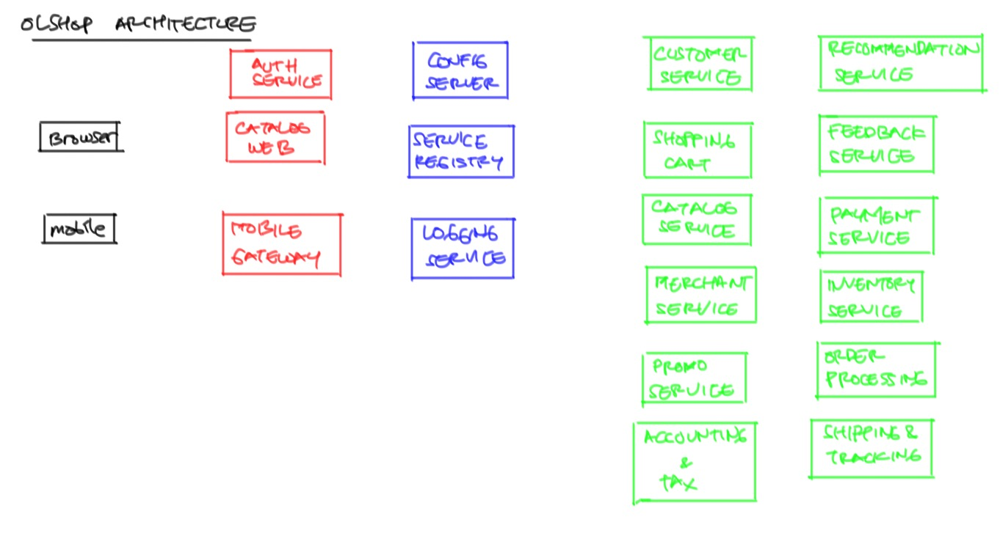

# Belajar Spring Cloud #

Studi Kasus :

Aplikasi online shop yang dibuat dengan microservice. Daftar semua modul terlihat seperti ini:



Keterangan:

* hitam : user/client apps
* merah : service yang bisa diakses dari user
* biru : service infrastruktur, untuk mengkoordinasikan service lain
* hijau : service internal, tidak bisa diakses langsung dari luar

## Komponen Aplikasi ##

Aplikasi lengkap akan terdiri dari beberapa microservices, antara lain:

* discovery-service : microservice yang bertugas untuk menyimpan daftar semua service. Terdiri dari 2 instance untuk keperluan failover
* folder config : repository config yang akan dibaca oleh Config Server
* config-server : microservice yang menghosting semua konfigurasi service lain
* catalog-service : microservice untuk menyediakan REST API daftar produk dan informasi produk
* catalog-webapp : aplikasi web yang menggunakan `catalog-service` untuk menampilkan daftar produk dalam format HTML/website
* api-gateway : microservice untuk menjadi pintu masuk semua request, kemudian mem-forward request ke service yang berwenang
* auth-service : microservice untuk login

Urutan development:

1. Implement discovery service
2. Implement config server
3. Implement catalog service
4. Implement catalog webapp
5. Implement security
6. Implement shopping cart
7. Implement merchant service
8. Implement merchant webapp

Urutan deployment:

1. Discovery service : kita akan mendeploy 2 instance agar bisa failover. Inilah satu-satunya service yang harus diketahui lokasi fisiknya (hostname dan port) oleh service lain. Untuk service lainnya, lokasi fisik bisa berpindah-pindah. Service satu menghubungi service lain dengan menggunakan namanya. Lokasi fisiknya akan disediakan oleh `discovery-service`.

2. Config repo dan config server. Setelah dideploy, dia akan mendaftarkan diri ke discovery services agar bisa diakses oleh service lain.
3. Backend Services : yaitu microservices yang bertugas menyediakan fungsi-fungsi aplikasi (misalnya catalog, shopping cart, dsb)
4. Authentication Service
5. API Gateway : pintu masuk untuk seluruh backend services


## Discovery Service ##

Ini adalah aplikasi yang menyimpan database berisi semua nama aplikasi dan lokasinya (host dan port). Ada beberapa implementasi discovery services, antara lain:

* Eureka
* Consul
* etcd
* Zookeeper

Tapi pada contoh ini, kita gunakan Eureka yang supportnya paling lengkap di Spring Boot. Lagipula, Consul dan Zookeeper membutuhkan instalasi aplikasi secara standalone, sehingga ribet setupnya. Eureka bisa dijalankan embedded dalam Spring Boot.

Eureka ingin dijalankan dengan lebih dari satu instance. Tujuannya supaya kalau satu node mati, masih ada cadangan. Bila kita tetap nekat menjalankan satu instance, bisa jalan tapi lognya berisik. Setiap sekian detik dia menampilkan pesan error karena tidak ketemu node lain.

Untuk itu, kita buat dua profile supaya satu aplikasi ini bisa dijalankan menjadi dua instance, yang satu jalan di port `10001`, satu lagi jalan di port `10002`.

Berikut cara menjalankan instance pertama:

        SPRING_PROFILES_ACTIVE=discovery1 mvn spring-boot:run

Dan berikut perintah untuk menjalankan instance kedua:

        SPRING_PROFILES_ACTIVE=discovery2 mvn spring-boot:run

Setelah keduanya jalan, kita bisa lihat service mana saja yang terdaftar dengan mengakses ke `http://localhost:10001/`

## Catalog Service ##

Pada saat dijalankan, aplikasi ini:

1. Menghubungi `discovery service` untuk mendaftarkan diri dan mencari `config server`
2. Menghubungi `config server` untuk mendapatkan konfigurasi
3. Barulah menjalankan diri sendiri

Untuk menjalankan aplikasi ini, tidak ada yang istimewa, langsung saja

        mvn clean spring-boot:run

Kemudian browse ke `http://localhost:30001/halo`. Kita akan mendapatkan output sebagai berikut:

```js
{
  "nama" : "Development User",
  "waktu" : "Fri Dec 30 00:41:00 WIB 2016"
}
```

Untuk mengetes apakah konfigurasi berjalan sempurna, kita bisa coba jalankan profile `testing` dengan cara mengeset environment variable `SPRING_PROFILES_ACTIVE` seperti ini

        SPRING_PROFILES_ACTIVE=testing mvn clean spring-boot:run

Harusnya `catalog service` akan menjalankan konfigurasi profile `testing` sehingga variabel `nama` akan berisi `Test User` seperti ini

```js
{
  "nama" : "Test User",
  "waktu" : "Fri Dec 30 00:43:47 WIB 2016"
}
```

## Config Server ##

Cara menjalankan:

1. Masuk ke foldernya

        cd config-server

2. Jalankan

        mvn clean spring-boot:run

3. Coba akses konfigurasi aplikasi `catalog` dengan profile `testing`

        curl http://localhost:8888/catalog/testing

4. Periksa outputnya, seharusnya seperti ini
        
        {
          "name" : "catalog",
          "profiles" : [ "testing" ],
          "label" : "master",
          "version" : "4bf57b8c943d17ff8b4664a8a70f93080c134a36",
          "state" : null,
          "propertySources" : [ {
            "name" : "https://github.com/endymuhardin/belajar-springcloud.git/config/catalog/application-testing.yml",
            "source" : {
              "nama" : "Test User"
            }
          }, {
            "name" : "https://github.com/endymuhardin/belajar-springcloud.git/config/catalog/application.yml",
            "source" : {
              "server.port" : 30001,
              "spring.datasource.url" : "jdbc:mysql://localhost/belajar",
              "spring.datasource.username" : "belajar",
              "nama" : "Development User",
              "spring.datasource.password" : "passwordDBdevelopment"
            }
          }, {
            "name" : "https://github.com/endymuhardin/belajar-springcloud.git/config/application.yml",
            "source" : {
              "spring.jackson.serialization.indent_output" : true
            }
          } ]
        }

5. Bila `spring.datasource.password` tidak terdekripsi, jalankan `config-server` dengan environment variable `ENCRYPT_KEY`

        ENCRYPT_KEY=inisymmetrickeyrahasiasekali mvn clean spring-boot:run

6. Bila mendapatkan output seperti dibawah ini, pastikan kita sudah menginstal Java Cryptography Extension seperti dijelaskan [di sini](http://stackoverflow.com/a/6481658)

        {
          "timestamp" : 1483025777244,
          "status" : 500,
          "error" : "Internal Server Error",
          "exception" : "java.lang.IllegalArgumentException",
          "message" : "Unable to initialize due to invalid secret key",
          "path" : "/encrypt"
        }

7. Sedangkan bila mendapatkan error seperti ini, berarti kita tidak memasang symmetric key dengan benar.

        {
          "description" : "No key was installed for encryption service",
          "status" : "NO_KEY"
        }

8. Selanjutnya, `config-server` ini seharusnya kita deploy ke cloud service seperti Heroku supaya mendapatkan hostname yang permanen. Soalnya nanti semua aplikasi lain akan mengambil konfigurasi dari `config-server` ini.

9. Bila ingin mengenkrip suatu nilai, misalnya `1234`, kita bisa menggunakan endpoint `/encrypt` seperti ini

        curl http://localhost:8888/encrypt -d 1234

   dan mendapatkan hasil seperti ini

        59e78e6f57c36a0e2347cf1f68ae7772594e1f77b3cb2bb358baf447cd304eda 

10. Nilai tersebut bisa kita pasang di file konfigurasi seperti ini

        password: {cipher}59e78e6f57c36a0e2347cf1f68ae7772594e1f77b3cb2bb358baf447cd304eda


## Referensi ##

* http://www.kennybastani.com/2016/04/event-sourcing-microservices-spring-cloud.html
* https://www.youtube.com/watch?v=cCEvFDhe3os
* https://www.youtube.com/watch?v=5q8B6lYhFvE
* http://www.baeldung.com/spring-cloud-netflix-eureka
* http://www.todaysoftmag.com/article/1429/micro-service-discovery-using-netflix-eureka